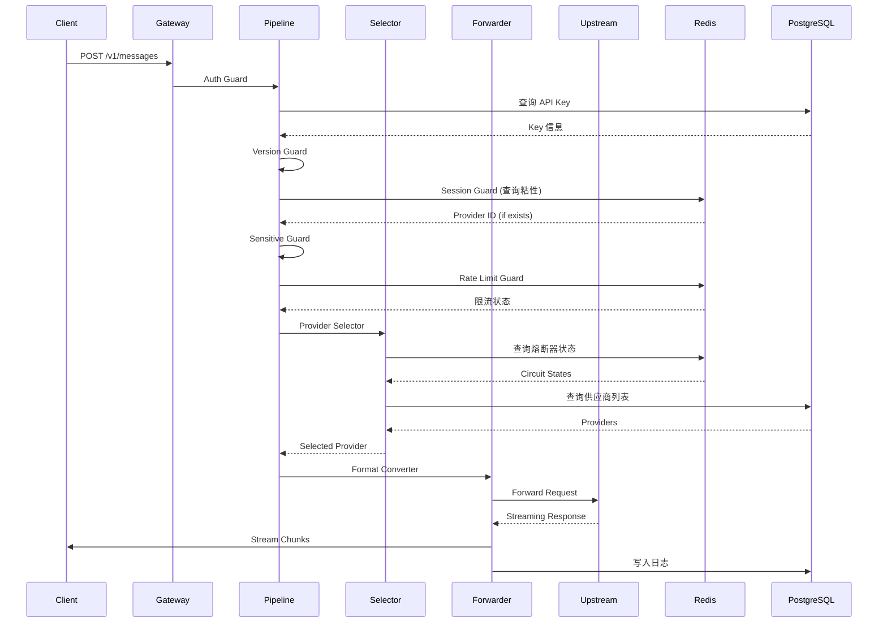

---
dimensions:
  type:
    primary: conceptual
    detail: architecture
  level: advanced
standard_title: 系统架构
language: zh
---

# 系统架构

Claude Code Hub 是一个基于模块化单体（Modular Monolith）架构的智能 AI API 代理平台，专为 Claude Code、Codex 等 AI 编码工具设计，提供多供应商管理、智能负载均衡、熔断器保护和全面监控能力。

## 技术栈决策

### 核心技术

| 层级 | 技术选型 | 选择理由 |
|------|----------|----------|
| **运行时** | Bun | 比 npm/yarn 更快的包管理和执行性能 |
| **框架** | Next.js 15 (App Router) | SSR + API 统一开发，Server Components 支持 |
| **前端** | React 19 + Tailwind CSS + shadcn/ui | 现代化 UI 组件库，快速开发 |
| **API 路由** | Hono | 亚毫秒级路由性能，适合代理场景 |
| **数据库** | PostgreSQL + Drizzle ORM | 类型安全的 SQL-first ORM |
| **缓存** | Redis (ioredis) | 分布式会话、限流、熔断器状态 |
| **HTTP 客户端** | undici | 比 node-fetch 更快的上游请求 |
| **验证** | Zod | 运行时 Schema 验证和 OpenAPI 生成 |

### 技术决策权衡

#### Hono vs Express/Fastify

**选择 Hono 的原因：**
- 路由性能：亚毫秒级（Express 10ms+）
- 代码体积：轻量级，适合边缘部署
- 现代 API：原生支持 Web Standards

**权衡：**
- 生态系统相对较小
- 社区支持不如 Express 广泛

#### Drizzle vs Prisma

**选择 Drizzle 的原因：**
- SQL-first 设计，更接近原生 SQL
- 更小的运行时开销
- 完整的类型安全

**权衡：**
- 学习曲线较陡
- 文档相对较少

---

## 模块化单体架构

### 架构概览

```
+-----------------------------------------------------------------------------+
|                              CLIENT LAYER                                    |
|  +-------------+  +-------------+  +-------------+  +-------------+         |
|  | Claude Code |  |  Codex CLI  |  | Cursor IDE  |  |  Admin UI   |         |
|  +------+------+  +------+------+  +------+------+  +------+------+         |
+---------|--------------|--------------|--------------|-----------------------+
          |              |              |              |
          v              v              v              v
+-----------------------------------------------------------------------------+
|                           API GATEWAY LAYER                                  |
|  +---------------------------------------------------------------------+    |
|  |                    Next.js 15 + Hono Router                          |    |
|  |  +-----------+  +-----------+  +-----------+  +-----------+          |    |
|  |  | /v1/      |  | /api/     |  | /settings |  | /dashboard|          |    |
|  |  | messages  |  | actions   |  | (UI)      |  | (UI)      |          |    |
|  |  +-----+-----+  +-----+-----+  +-----+-----+  +-----+-----+          |    |
|  +--------|--------------|--------------|--------------|-----------------+    |
+-----------|--------------|--------------|--------------|--------------------- +
            |              |              |              |
            v              v              v              v
+-----------------------------------------------------------------------------+
|                         GUARD PIPELINE LAYER                                 |
|  +--------+ +--------+ +--------+ +--------+ +--------+ +--------+          |
|  |  Auth  |>|Version |>| Probe  |>|Session |>|Sensitiv|>|  Rate  |>...      |
|  | Guard  | | Guard  | |Handler | | Guard  | | Guard  | | Limit  |          |
|  +--------+ +--------+ +--------+ +--------+ +--------+ +--------+          |
+-----------------------------------------------------------------------------+
            |
            v
+-----------------------------------------------------------------------------+
|                        PROXY CORE LAYER                                      |
|  +-----------------+  +-----------------+  +-----------------+               |
|  | Provider        |  | Format          |  | Response        |               |
|  | Selector        |  | Converter       |  | Handler         |               |
|  | (weighted LB)   |  | (Claude<>OpenAI)|  | (streaming)     |               |
|  +--------+--------+  +--------+--------+  +--------+--------+               |
|           |                    |                    |                        |
|  +--------+--------------------+--------------------+--------+               |
|  |                    Circuit Breaker                        |               |
|  |  +---------+  +---------+  +---------+                    |               |
|  |  | CLOSED  |<>|  OPEN   |<>|HALF-OPEN|                    |               |
|  |  +---------+  +---------+  +---------+                    |               |
|  +-----------------------------------------------------------+               |
+-----------------------------------------------------------------------------+
            |
            v
+-----------------------------------------------------------------------------+
|                       UPSTREAM PROVIDERS                                     |
|  +----------+  +----------+  +----------+  +----------+  +----------+       |
|  | Anthropic|  |  OpenAI  |  |  Gemini  |  |  Relay   |  |  Custom  |       |
|  | (claude) |  | (codex)  |  | (gemini) |  |(claude-  |  |(openai-  |       |
|  |          |  |          |  |          |  |  auth)   |  |compatible|       |
|  +----------+  +----------+  +----------+  +----------+  +----------+       |
+-----------------------------------------------------------------------------+

+-----------------------------------------------------------------------------+
|                         DATA LAYER                                           |
|  +-------------------------+      +-------------------------+                |
|  |       PostgreSQL        |      |          Redis          |                |
|  |  +-----+ +-----+ +----+ |      |  +-----+ +-----+ +----+ |                |
|  |  |users| |keys | |prov| |      |  |sess | |rate | |circ| |                |
|  |  +-----+ +-----+ +----+ |      |  |ions | |limit| |uit | |                |
|  |  |msgs | |rules| |conf| |      |  +-----+ +-----+ +----+ |                |
|  |  +-----+ +-----+ +----+ |      +-------------------------+                |
|  +-------------------------+                                                 |
+-----------------------------------------------------------------------------+
```

### 架构选择理由

**为什么选择模块化单体而非微服务：**

1. **低延迟要求**：代理延迟需控制在 50ms 以内，跨服务网络调用成本过高
2. **部署简化**：单一部署单元，降低运维复杂度
3. **开发一致性**：Next.js 提供统一的前后端开发体验
4. **团队规模**：开源项目无需服务自治带来的组织隔离

### 模块划分

```
src/
+-- app/                    # Next.js App Router
|   +-- v1/                 # 代理端点
|   |   +-- _lib/           # 代理核心
|   |       +-- proxy/      # Guard Pipeline, Forwarder
|   |       +-- converters/ # 格式转换器
|   |       +-- gemini/     # Gemini 专用逻辑
|   +-- api/                # REST API
|   |   +-- actions/        # OpenAPI 文档
|   +-- dashboard/          # 管理后台页面
|   +-- settings/           # 设置页面
+-- actions/                # Server Actions
+-- repository/             # 数据库查询层
+-- drizzle/                # Schema + Migrations
+-- lib/                    # 共享工具
|   +-- rate-limit/         # 限流逻辑
|   +-- circuit-breaker/    # 熔断器
|   +-- session/            # 会话管理
+-- types/                  # TypeScript 类型
+-- components/             # React 组件
```

### 模块依赖规则

```
UI Components
     |
     v
Server Actions
     |
     v
Repository Layer
     |
     v
Drizzle Schema
     |
     v
PostgreSQL

Guards & Pipeline
     |
     +---> Redis (Session, Rate Limit, Circuit)
     |
     v
Format Converters
     |
     v
Provider Adapters
     |
     v
Upstream APIs
```

---

## Guard Pipeline

Guard Pipeline 是请求处理的核心机制，通过有序的中间件链处理所有代理请求。

### Pipeline 配置

```typescript
// 完整的 Chat 请求 Pipeline
const CHAT_PIPELINE = [
  "auth",           // API Key 验证
  "version",        // 客户端版本检查
  "probe",          // 探测请求处理
  "session",        // 会话粘性
  "sensitive",      // 敏感词过滤
  "rateLimit",      // 限流检查
  "provider",       // 供应商选择
  "messageContext", // 请求日志
];

// 简化的 count_tokens Pipeline
const COUNT_TOKENS_PIPELINE = [
  "auth",
  "version",
  "probe",
  "provider"
];
```

### Guard 详解

#### Auth Guard

验证 API Key 的有效性：

```typescript
interface AuthGuard {
  // 验证流程
  // 1. 提取 Authorization: Bearer {key} 或 x-api-key
  // 2. 计算 SHA-256 哈希
  // 3. 数据库查询匹配
  // 4. 检查启用状态和过期时间
  execute(session: ProxySession): Promise<Response | null>;
}
```

**安全特性：**
- 密钥哈希存储（SHA-256）
- 常量时间比较（防时序攻击）
- 失败请求限流

#### Version Guard

检查客户端版本兼容性：

```typescript
interface VersionGuard {
  // 从 x-client-version 或 User-Agent 提取版本
  // 与系统配置的最低版本要求比对
  execute(session: ProxySession): Promise<Response | null>;
}
```

#### Session Guard

实现会话粘性（Session Stickiness）：

```typescript
interface SessionGuard {
  // Redis Key: session:{session_id}
  // Value: { providerId: number, createdAt: timestamp }
  // TTL: 300 秒 (5 分钟)

  execute(session: ProxySession): Promise<Response | null>;
}
```

**目的：** 确保同一会话的请求路由到同一供应商，避免上下文丢失。

#### Sensitive Guard

内容过滤检查：

```typescript
interface SensitiveGuard {
  // 加载敏感词规则（支持 contains/exact/regex）
  // 检查请求内容
  // 命中则拒绝请求
  execute(session: ProxySession): Promise<Response | null>;
}
```

#### Rate Limit Guard

多维度限流控制：

```typescript
interface RateLimitGuard {
  // 检查维度：
  // 1. RPM (每分钟请求数) - 滑动窗口
  // 2. 5小时消费 - 滚动窗口
  // 3. 日消费 - 固定/滚动窗口
  // 4. 周消费 - 自然周
  // 5. 月消费 - 自然月
  // 6. 并发会话数

  execute(session: ProxySession): Promise<Response | null>;
}
```

**Redis Lua 脚本：** 使用原子操作确保分布式环境下的准确性。

#### Provider Selector

智能供应商选择：

```typescript
interface ProviderSelector {
  // 选择算法：
  // 1. 过滤启用的供应商
  // 2. 排除熔断器 OPEN 状态的供应商
  // 3. 按用户 providerGroup 过滤
  // 4. 检查 Session 缓存（粘性）
  // 5. 无粘性时按权重随机选择

  execute(session: ProxySession): Promise<Response | null>;
}
```

---

## 数据流

### 请求处理流程



### 代理转发逻辑

```typescript
// 1. 格式转换
const upstreamRequest = converter.convertRequest(
  session.request,
  provider.type
);

// 2. 发送请求（带超时）
const response = await fetch(provider.url, {
  method: 'POST',
  headers: upstreamRequest.headers,
  body: upstreamRequest.body,
  signal: AbortSignal.timeout(provider.timeout),
});

// 3. 流式响应处理
const stream = new ReadableStream({
  async pull(controller) {
    const chunk = await reader.read();
    if (chunk.done) {
      controller.close();
      // 记录完成状态
      await logRequest(session, 'completed');
    } else {
      // 格式转换 & Token 计数
      const converted = converter.convertStreamChunk(chunk.value);
      controller.enqueue(converted);
    }
  }
});
```

### 响应处理

```typescript
interface ResponseHandler {
  // 职责：
  // 1. 流式响应转发（零拷贝）
  // 2. 错误分类和处理
  // 3. Token 计数
  // 4. 成本计算
  // 5. 请求日志写入
}
```

---

## 熔断器机制

### 状态机

```
                    failure threshold reached
        +-------------------------------------------+
        |                                           v
    +-------+                                 +---------+
    |CLOSED |                                 |  OPEN   |
    +---+---+                                 +----+----+
        |                                          |
        | success                                  | timeout expires
        |                                          v
        |                                   +-----------+
        +-----------------------------------|HALF-OPEN  |
                  success threshold         +-----------+
```

### 配置参数

```typescript
interface CircuitBreakerConfig {
  // 触发熔断的连续失败次数
  failureThreshold: number;        // 默认: 5

  // 熔断持续时间（毫秒）
  openDuration: number;            // 默认: 1800000 (30分钟)

  // 半开状态成功阈值
  halfOpenSuccessThreshold: number; // 默认: 2
}
```

### Redis 状态存储

```
Key: cb:{providerId}
Hash Fields:
  - state: CLOSED | OPEN | HALF_OPEN
  - failures: number
  - successes: number (half-open)
  - openedAt: timestamp
```

---

## 高可用设计

### 无单点故障

```
                    Load Balancer
                          |
          +---------------+---------------+
          |               |               |
      +---+---+       +---+---+       +---+---+
      | CCH-1 |       | CCH-2 |       | CCH-3 |
      +---+---+       +---+---+       +---+---+
          |               |               |
          +---------------+---------------+
                          |
              +-----------+-----------+
              |                       |
          +---+---+               +---+---+
          | Redis |               |Postgres|
          |Sentinel|              |Primary |
          +---+---+               +---+---+
              |                       |
          +---+---+               +---+---+
          | Redis |               |Postgres|
          |Replica|               |Replica |
          +-------+               +--------+
```

### 优雅降级策略

| 组件 | 故障场景 | 降级策略 |
|------|----------|----------|
| Redis | 连接失败 | Fail-Open（允许请求通过） |
| 单个 Provider | 熔断器开启 | 自动切换到下一个 Provider |
| 数据库读取 | 查询超时 | 使用内存缓存数据 |

### 健康检查

```typescript
// GET /api/health
{
  "status": "healthy",
  "checks": {
    "database": "ok",
    "redis": "ok"
  },
  "timestamp": "2024-01-15T10:30:00Z"
}
```

---

## 性能优化

### 延迟优化目标

| 指标 | 目标值 | 实现方式 |
|------|--------|----------|
| 代理开销 | < 50ms | Hono 路由 + Redis 缓存 |
| P99 延迟 | < 200ms | 连接池 + 流式响应 |
| 数据库查询 | < 10ms | 索引优化 + 预编译语句 |

### 缓存分层

```
+-------------------------------------+
|         CDN (Static Assets)         |  TTL: Long
+-----------------+-------------------+
|     Application Cache (In-Memory)   |  TTL: Short
|  - Provider list                    |
|  - Error rules                      |
|  - Sensitive words                  |
+-----------------+-------------------+
|            Redis Cache              |  TTL: Medium
|  - Session mappings                 |
|  - Rate limit counters              |
|  - Circuit breaker state            |
+-----------------+-------------------+
|         PostgreSQL                  |  Source of truth
+-------------------------------------+
```

### 并发处理

- **无状态设计**：应用层无状态，支持水平扩展
- **连接池**：PostgreSQL 和 Redis 连接复用
- **流式处理**：响应流式转发，无内存缓冲

---

## 部署架构

### Docker Compose (开发/小规模)

```yaml
version: "3.8"
services:
  app:
    image: claude-code-hub:latest
    ports:
      - "3000:3000"
    environment:
      - DSN=postgresql://...
      - REDIS_URL=redis://...
      - ADMIN_TOKEN=...
    depends_on:
      - postgres
      - redis

  postgres:
    image: postgres:15
    volumes:
      - pgdata:/var/lib/postgresql/data

  redis:
    image: redis:7
    volumes:
      - redisdata:/data
```

### 生产环境建议

| 组件 | 配置建议 |
|------|----------|
| App 实例 | 2+ 实例，4 CPU / 8GB 内存 |
| PostgreSQL | 主从复制，4 CPU / 16GB 内存 |
| Redis | Sentinel 或 Cluster 模式 |
| 负载均衡 | Nginx / Traefik / Cloud LB |

---

## 相关文档

- [Server Actions API](/docs/server-actions-api) - REST API 详细参考
- [供应商管理](/docs/provider-management) - 上游服务商配置
- [熔断器机制](/docs/circuit-breaker) - 熔断器详细说明
- [限流配置](/docs/rate-limiting) - 多维度限流规则
