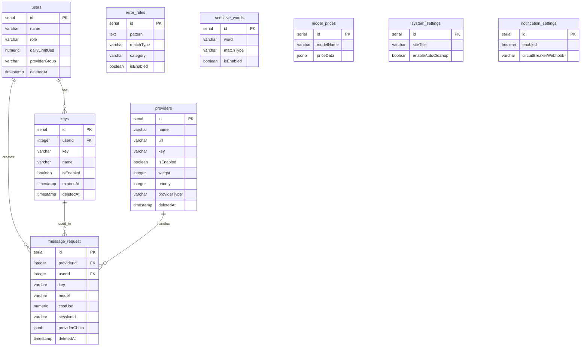

# 数据库 Schema 参考

本文档详细说明 Claude Code Hub 的数据库结构设计，包括所有表定义、字段说明、索引策略和表关系。适合需要理解系统数据模型或进行二次开发的开发者参考。

---

## 概述

### 数据库设计原则

Claude Code Hub 采用 **PostgreSQL** 作为主数据库，使用 **Drizzle ORM** 管理 Schema 和迁移。数据库设计遵循以下原则：

1. **软删除模式**：所有主要业务表都包含 `deletedAt` 字段，删除操作仅设置此字段而非物理删除
2. **时间戳追踪**：每个表包含 `createdAt` 和 `updatedAt` 字段，自动记录创建和更新时间
3. **类型安全**：使用 Drizzle ORM 的 TypeScript 类型推导，确保代码与数据库结构一致
4. **索引优化**：针对高频查询场景设计复合索引，部分索引使用条件过滤提升效率
5. **JSON 扩展**：使用 JSONB 类型存储灵活的配置数据（如模型重定向、决策链）

### 技术栈

| 组件 | 说明 |
| --- | --- |
| **数据库** | PostgreSQL 14+ |
| **ORM** | Drizzle ORM |
| **Schema 位置** | `src/drizzle/schema.ts` |
| **迁移文件** | `drizzle/` 目录 |

---

## 表结构总览

Claude Code Hub 包含以下 9 个数据表：

| 表名 | 说明 | 软删除 |
| --- | --- | --- |
| `users` | 用户信息和配额配置 | 是 |
| `keys` | API Key 及其限制配置 | 是 |
| `providers` | 上游供应商配置 | 是 |
| `message_request` | 请求日志记录 | 是 |
| `error_rules` | 错误处理规则 | 否 |
| `sensitive_words` | 敏感词过滤规则 | 否 |
| `model_prices` | 模型价格数据 | 否 |
| `system_settings` | 系统全局设置 | 否 |
| `notification_settings` | 通知配置 | 否 |

---

## users 表

用户表存储系统中所有用户的基本信息和配额配置。

### 字段定义

| 字段名 | 类型 | 可空 | 默认值 | 说明 |
| --- | --- | --- | --- | --- |
| `id` | serial | 否 | 自增 | 主键 |
| `name` | varchar | 否 | - | 用户名称 |
| `description` | text | 是 | null | 用户描述 |
| `role` | varchar | 是 | `'user'` | 角色（user/admin） |
| `rpmLimit` | integer | 是 | `60` | 每分钟请求数限制 |
| `dailyLimitUsd` | numeric(10,2) | 是 | `'100.00'` | 每日消费限制（美元） |
| `providerGroup` | varchar(50) | 是 | null | 供应商分组标签 |
| `limit5hUsd` | numeric(10,2) | 是 | null | 5 小时消费限制（美元） |
| `limitWeeklyUsd` | numeric(10,2) | 是 | null | 每周消费限制（美元） |
| `limitMonthlyUsd` | numeric(10,2) | 是 | null | 每月消费限制（美元） |
| `limitConcurrentSessions` | integer | 是 | null | 并发 Session 限制 |
| `createdAt` | timestamp(tz) | 是 | `now()` | 创建时间 |
| `updatedAt` | timestamp(tz) | 是 | `now()` | 更新时间 |
| `deletedAt` | timestamp(tz) | 是 | null | 软删除时间 |

### 索引

| 索引名 | 字段 | 类型 | 条件 | 说明 |
| --- | --- | --- | --- | --- |
| `idx_users_active_role_sort` | deletedAt, role, id | 复合 | `deletedAt IS NULL` | 优化用户列表查询 |
| `idx_users_created_at` | createdAt | 基础 | - | 创建时间查询 |
| `idx_users_deleted_at` | deletedAt | 基础 | - | 软删除过滤 |

### Schema 代码片段

```typescript
export const users = pgTable('users', {
  id: serial('id').primaryKey(),
  name: varchar('name').notNull(),
  description: text('description'),
  role: varchar('role').default('user'),
  rpmLimit: integer('rpm_limit').default(60),
  dailyLimitUsd: numeric('daily_limit_usd', { precision: 10, scale: 2 }).default('100.00'),
  providerGroup: varchar('provider_group', { length: 50 }),
  limit5hUsd: numeric('limit_5h_usd', { precision: 10, scale: 2 }),
  limitWeeklyUsd: numeric('limit_weekly_usd', { precision: 10, scale: 2 }),
  limitMonthlyUsd: numeric('limit_monthly_usd', { precision: 10, scale: 2 }),
  limitConcurrentSessions: integer('limit_concurrent_sessions'),
  createdAt: timestamp('created_at', { withTimezone: true }).defaultNow(),
  updatedAt: timestamp('updated_at', { withTimezone: true }).defaultNow(),
  deletedAt: timestamp('deleted_at', { withTimezone: true }),
}, (table) => ({
  usersActiveRoleSortIdx: index('idx_users_active_role_sort')
    .on(table.deletedAt, table.role, table.id)
    .where(sql`${table.deletedAt} IS NULL`),
  usersCreatedAtIdx: index('idx_users_created_at').on(table.createdAt),
  usersDeletedAtIdx: index('idx_users_deleted_at').on(table.deletedAt),
}));
```

---

## keys 表

API Key 表存储用户的 API 密钥及其独立的限制配置。

### 字段定义

| 字段名 | 类型 | 可空 | 默认值 | 说明 |
| --- | --- | --- | --- | --- |
| `id` | serial | 否 | 自增 | 主键 |
| `userId` | integer | 否 | - | 关联用户 ID（外键） |
| `key` | varchar | 否 | - | API Key（SHA-256 哈希存储） |
| `name` | varchar | 否 | - | Key 名称 |
| `isEnabled` | boolean | 是 | `true` | 是否启用 |
| `expiresAt` | timestamp | 是 | null | 过期时间 |
| `canLoginWebUi` | boolean | 是 | `true` | 是否允许 Web UI 登录 |
| `limit5hUsd` | numeric(10,2) | 是 | null | 5 小时消费限制 |
| `limitDailyUsd` | numeric(10,2) | 是 | null | 每日消费限制 |
| `dailyResetMode` | enum | 否 | `'fixed'` | 每日重置模式（fixed/rolling） |
| `dailyResetTime` | varchar(5) | 否 | `'00:00'` | 每日重置时间（HH:mm） |
| `limitWeeklyUsd` | numeric(10,2) | 是 | null | 每周消费限制 |
| `limitMonthlyUsd` | numeric(10,2) | 是 | null | 每月消费限制 |
| `limitConcurrentSessions` | integer | 是 | `0` | 并发 Session 限制 |
| `createdAt` | timestamp(tz) | 是 | `now()` | 创建时间 |
| `updatedAt` | timestamp(tz) | 是 | `now()` | 更新时间 |
| `deletedAt` | timestamp(tz) | 是 | null | 软删除时间 |

### 枚举类型

```typescript
export const dailyResetModeEnum = pgEnum('daily_reset_mode', ['fixed', 'rolling']);
```

| 值 | 说明 |
| --- | --- |
| `fixed` | 固定时间重置（由 `dailyResetTime` 指定） |
| `rolling` | 滚动 24 小时窗口 |

### 索引

| 索引名 | 字段 | 类型 | 说明 |
| --- | --- | --- | --- |
| `idx_keys_user_id` | userId | 基础 | 外键查询优化 |
| `idx_keys_created_at` | createdAt | 基础 | 创建时间查询 |
| `idx_keys_deleted_at` | deletedAt | 基础 | 软删除过滤 |

### 与 users 表的关系

```typescript
export const keysRelations = relations(keys, ({ one, many }) => ({
  user: one(users, {
    fields: [keys.userId],
    references: [users.id],
  }),
  messageRequests: many(messageRequest),
}));
```

- 每个 Key 属于一个 User（多对一）
- 一个 Key 可以关联多条请求日志（一对多）

---

## providers 表

供应商表存储上游 AI API 供应商的完整配置信息。

### 基础字段

| 字段名 | 类型 | 可空 | 默认值 | 说明 |
| --- | --- | --- | --- | --- |
| `id` | serial | 否 | 自增 | 主键 |
| `name` | varchar | 否 | - | 供应商名称 |
| `description` | text | 是 | null | 描述信息 |
| `url` | varchar | 否 | - | API 端点地址 |
| `key` | varchar | 否 | - | API 密钥 |
| `isEnabled` | boolean | 否 | `true` | 是否启用 |
| `providerType` | varchar(20) | 否 | `'claude'` | 供应商类型 |

### 供应商类型（providerType）

| 值 | 说明 | 认证方式 |
| --- | --- | --- |
| `claude` | Anthropic 官方 API | x-api-key + Bearer |
| `claude-auth` | Claude 中转服务 | 仅 Bearer Token |
| `codex` | OpenAI Codex/Response API | Bearer Token |
| `gemini` | Google Gemini API | API Key |
| `gemini-cli` | Gemini CLI 格式 | API Key |
| `openai-compatible` | OpenAI 兼容 API | Bearer Token |

### 调度相关字段

| 字段名 | 类型 | 可空 | 默认值 | 说明 |
| --- | --- | --- | --- | --- |
| `weight` | integer | 否 | `1` | 权重（1-100） |
| `priority` | integer | 否 | `0` | 优先级（越小越优先） |
| `costMultiplier` | numeric(10,4) | 是 | `'1.0'` | 成本系数 |
| `groupTag` | varchar(50) | 是 | null | 分组标签 |

### 限制字段

| 字段名 | 类型 | 可空 | 默认值 | 说明 |
| --- | --- | --- | --- | --- |
| `limit5hUsd` | numeric(10,2) | 是 | null | 5 小时消费限制 |
| `limitDailyUsd` | numeric(10,2) | 是 | null | 每日消费限制 |
| `dailyResetMode` | enum | 否 | `'fixed'` | 每日重置模式 |
| `dailyResetTime` | varchar(5) | 否 | `'00:00'` | 每日重置时间 |
| `limitWeeklyUsd` | numeric(10,2) | 是 | null | 每周消费限制 |
| `limitMonthlyUsd` | numeric(10,2) | 是 | null | 每月消费限制 |
| `limitConcurrentSessions` | integer | 是 | `0` | 并发 Session 限制 |

### 熔断器字段

| 字段名 | 类型 | 可空 | 默认值 | 说明 |
| --- | --- | --- | --- | --- |
| `circuitBreakerFailureThreshold` | integer | 是 | `5` | 触发熔断的失败次数 |
| `circuitBreakerOpenDuration` | integer | 是 | `1800000` | 熔断持续时间（毫秒，默认 30 分钟） |
| `circuitBreakerHalfOpenSuccessThreshold` | integer | 是 | `2` | 恢复需要的成功次数 |

### 超时配置字段

| 字段名 | 类型 | 可空 | 默认值 | 说明 |
| --- | --- | --- | --- | --- |
| `firstByteTimeoutStreamingMs` | integer | 否 | `0` | 流式首字节超时（毫秒，0=不限制） |
| `streamingIdleTimeoutMs` | integer | 否 | `0` | 流式空闲超时（毫秒，0=不限制） |
| `requestTimeoutNonStreamingMs` | integer | 否 | `0` | 非流式总超时（毫秒，0=不限制） |

### 代理配置字段

| 字段名 | 类型 | 可空 | 默认值 | 说明 |
| --- | --- | --- | --- | --- |
| `proxyUrl` | varchar(512) | 是 | null | 代理服务器地址 |
| `proxyFallbackToDirect` | boolean | 是 | `false` | 代理失败时降级直连 |

### 模型配置字段

| 字段名 | 类型 | 可空 | 默认值 | 说明 |
| --- | --- | --- | --- | --- |
| `modelRedirects` | jsonb | 是 | null | 模型名称重定向映射 |
| `allowedModels` | jsonb | 是 | null | 允许的模型列表 |
| `joinClaudePool` | boolean | 是 | `false` | 加入 Claude 调度池 |

### 特性配置字段

| 字段名 | 类型 | 可空 | 默认值 | 说明 |
| --- | --- | --- | --- | --- |
| `codexInstructionsStrategy` | varchar(20) | 是 | `'auto'` | Codex instructions 策略 |
| `mcpPassthroughType` | varchar(20) | 否 | `'none'` | MCP 透传类型 |
| `mcpPassthroughUrl` | varchar(512) | 是 | null | MCP 服务 URL |

### 元数据字段

| 字段名 | 类型 | 可空 | 默认值 | 说明 |
| --- | --- | --- | --- | --- |
| `websiteUrl` | text | 是 | null | 供应商官网地址 |
| `faviconUrl` | text | 是 | null | 网站图标 URL |
| `createdAt` | timestamp(tz) | 是 | `now()` | 创建时间 |
| `updatedAt` | timestamp(tz) | 是 | `now()` | 更新时间 |
| `deletedAt` | timestamp(tz) | 是 | null | 软删除时间 |

### 废弃字段（保留向后兼容）

| 字段名 | 类型 | 说明 |
| --- | --- | --- |
| `tpm` | integer | Tokens Per Minute（已废弃） |
| `rpm` | integer | Requests Per Minute（已废弃） |
| `rpd` | integer | Requests Per Day（已废弃） |
| `cc` | integer | Concurrent Connections（已废弃） |

### 索引

| 索引名 | 字段 | 类型 | 条件 | 说明 |
| --- | --- | --- | --- | --- |
| `idx_providers_enabled_priority` | isEnabled, priority, weight | 复合 | `deletedAt IS NULL` | 优化供应商选择查询 |
| `idx_providers_group` | groupTag | 基础 | `deletedAt IS NULL` | 分组查询优化 |
| `idx_providers_created_at` | createdAt | 基础 | - | 创建时间查询 |
| `idx_providers_deleted_at` | deletedAt | 基础 | - | 软删除过滤 |

---

## message_request 表

请求日志表记录所有经过代理的 API 请求详情。

### 字段定义

| 字段名 | 类型 | 可空 | 默认值 | 说明 |
| --- | --- | --- | --- | --- |
| `id` | serial | 否 | 自增 | 主键 |
| `providerId` | integer | 否 | - | 供应商 ID（外键） |
| `userId` | integer | 否 | - | 用户 ID（外键） |
| `key` | varchar | 否 | - | 使用的 API Key |
| `model` | varchar(128) | 是 | null | 实际使用的模型 |
| `originalModel` | varchar(128) | 是 | null | 原始请求模型（重定向前） |
| `sessionId` | varchar(64) | 是 | null | Session ID |
| `durationMs` | integer | 是 | null | 请求耗时（毫秒） |
| `costUsd` | numeric(21,15) | 是 | `'0'` | 消费金额（美元） |
| `costMultiplier` | numeric(10,4) | 是 | null | 使用的成本系数 |
| `statusCode` | integer | 是 | null | HTTP 状态码 |
| `apiType` | varchar(20) | 是 | null | API 类型（response/openai） |
| `endpoint` | varchar(256) | 是 | null | 请求端点路径 |
| `inputTokens` | integer | 是 | null | 输入 Token 数 |
| `outputTokens` | integer | 是 | null | 输出 Token 数 |
| `cacheCreationInputTokens` | integer | 是 | null | 缓存创建 Token 数 |
| `cacheReadInputTokens` | integer | 是 | null | 缓存读取 Token 数 |
| `errorMessage` | text | 是 | null | 错误信息 |
| `blockedBy` | varchar(50) | 是 | null | 拦截类型 |
| `blockedReason` | text | 是 | null | 拦截原因 |
| `userAgent` | varchar(512) | 是 | null | 客户端 User-Agent |
| `messagesCount` | integer | 是 | null | 消息数量 |
| `providerChain` | jsonb | 是 | null | 决策链记录 |
| `createdAt` | timestamp(tz) | 是 | `now()` | 创建时间 |
| `updatedAt` | timestamp(tz) | 是 | `now()` | 更新时间 |
| `deletedAt` | timestamp(tz) | 是 | null | 软删除时间 |

### providerChain JSON 字段

`providerChain` 字段记录请求的供应商决策链，格式为 JSON 数组：

```typescript
type ProviderChain = Array<{
  id: number;    // 供应商 ID
  name: string;  // 供应商名称
}>;
```

**示例：**

```json
[
  { "id": 1, "name": "主力 Claude API" },
  { "id": 2, "name": "备用 Claude API" }
]
```

这表示请求首先尝试了供应商 1，失败后自动切换到供应商 2。

### 索引

| 索引名 | 字段 | 类型 | 条件 | 说明 |
| --- | --- | --- | --- | --- |
| `idx_message_request_user_date_cost` | userId, createdAt, costUsd | 复合 | `deletedAt IS NULL` | 统计查询优化 |
| `idx_message_request_user_query` | userId, createdAt | 复合 | `deletedAt IS NULL` | 用户日志查询 |
| `idx_message_request_session_id` | sessionId | 基础 | `deletedAt IS NULL` | Session 聚合查询 |
| `idx_message_request_endpoint` | endpoint | 基础 | `deletedAt IS NULL` | 端点过滤查询 |
| `idx_message_request_provider_id` | providerId | 基础 | - | 供应商关联查询 |
| `idx_message_request_user_id` | userId | 基础 | - | 用户关联查询 |
| `idx_message_request_key` | key | 基础 | - | Key 关联查询 |
| `idx_message_request_created_at` | createdAt | 基础 | - | 时间范围查询 |
| `idx_message_request_deleted_at` | deletedAt | 基础 | - | 软删除过滤 |

---

## error_rules 表

错误规则表定义错误响应的匹配和处理规则。

### 字段定义

| 字段名 | 类型 | 可空 | 默认值 | 说明 |
| --- | --- | --- | --- | --- |
| `id` | serial | 否 | 自增 | 主键 |
| `pattern` | text | 否 | - | 匹配模式 |
| `matchType` | varchar(20) | 否 | `'regex'` | 匹配类型（regex/contains/exact） |
| `category` | varchar(50) | 否 | - | 规则分类 |
| `description` | text | 是 | null | 规则描述 |
| `overrideResponse` | jsonb | 是 | null | 覆写响应体 |
| `overrideStatusCode` | integer | 是 | null | 覆写状态码 |
| `isEnabled` | boolean | 否 | `true` | 是否启用 |
| `isDefault` | boolean | 否 | `false` | 是否为默认规则 |
| `priority` | integer | 否 | `0` | 优先级 |
| `createdAt` | timestamp(tz) | 是 | `now()` | 创建时间 |
| `updatedAt` | timestamp(tz) | 是 | `now()` | 更新时间 |

### 匹配类型（matchType）

| 值 | 说明 |
| --- | --- |
| `regex` | 正则表达式匹配 |
| `contains` | 包含匹配 |
| `exact` | 精确匹配 |

### overrideResponse JSON 字段

覆写响应体格式参考 Claude API 错误格式：

```json
{
  "type": "error",
  "error": {
    "type": "overloaded_error",
    "message": "供应商繁忙，请稍后重试"
  }
}
```

### 索引

| 索引名 | 字段 | 类型 | 说明 |
| --- | --- | --- | --- |
| `idx_error_rules_enabled` | isEnabled, priority | 复合 | 启用规则查询 |
| `unique_pattern` | pattern | 唯一 | 模式唯一性约束 |
| `idx_category` | category | 基础 | 分类查询 |
| `idx_match_type` | matchType | 基础 | 类型查询 |

---

## sensitive_words 表

敏感词表存储内容过滤规则。

### 字段定义

| 字段名 | 类型 | 可空 | 默认值 | 说明 |
| --- | --- | --- | --- | --- |
| `id` | serial | 否 | 自增 | 主键 |
| `word` | varchar(255) | 否 | - | 敏感词/模式 |
| `matchType` | varchar(20) | 否 | `'contains'` | 匹配类型 |
| `description` | text | 是 | null | 规则描述 |
| `isEnabled` | boolean | 否 | `true` | 是否启用 |
| `createdAt` | timestamp(tz) | 是 | `now()` | 创建时间 |
| `updatedAt` | timestamp(tz) | 是 | `now()` | 更新时间 |

### 索引

| 索引名 | 字段 | 类型 | 说明 |
| --- | --- | --- | --- |
| `idx_sensitive_words_enabled` | isEnabled, matchType | 复合 | 启用规则查询 |
| `idx_sensitive_words_created_at` | createdAt | 基础 | 时间查询 |

---

## model_prices 表

模型价格表存储各模型的计费信息。

### 字段定义

| 字段名 | 类型 | 可空 | 默认值 | 说明 |
| --- | --- | --- | --- | --- |
| `id` | serial | 否 | 自增 | 主键 |
| `modelName` | varchar | 否 | - | 模型名称 |
| `priceData` | jsonb | 否 | - | 价格数据 |
| `createdAt` | timestamp(tz) | 是 | `now()` | 创建时间 |
| `updatedAt` | timestamp(tz) | 是 | `now()` | 更新时间 |

### priceData JSON 字段

价格数据为 JSON 对象，包含输入/输出 Token 价格：

```json
{
  "input_cost_per_token": 0.000003,
  "output_cost_per_token": 0.000015,
  "cache_creation_input_token_cost": 0.00000375,
  "cache_read_input_token_cost": 0.0000003
}
```

### 索引

| 索引名 | 字段 | 类型 | 说明 |
| --- | --- | --- | --- |
| `idx_model_prices_latest` | modelName, createdAt DESC | 复合 | 获取最新价格 |
| `idx_model_prices_model_name` | modelName | 基础 | 模型查询 |
| `idx_model_prices_created_at` | createdAt DESC | 基础 | 时间排序 |

---

## system_settings 表

系统设置表存储全局配置项（单行记录）。

### 字段定义

| 字段名 | 类型 | 可空 | 默认值 | 说明 |
| --- | --- | --- | --- | --- |
| `id` | serial | 否 | 自增 | 主键 |
| `siteTitle` | varchar(128) | 否 | `'Claude Code Hub'` | 站点标题 |
| `allowGlobalUsageView` | boolean | 否 | `false` | 允许查看全局使用统计 |
| `currencyDisplay` | varchar(10) | 否 | `'USD'` | 货币显示单位 |
| `billingModelSource` | varchar(20) | 否 | `'original'` | 计费模型来源（original/redirected） |
| `enableAutoCleanup` | boolean | 是 | `false` | 启用自动清理 |
| `cleanupRetentionDays` | integer | 是 | `30` | 日志保留天数 |
| `cleanupSchedule` | varchar(50) | 是 | `'0 2 * * *'` | 清理 Cron 表达式 |
| `cleanupBatchSize` | integer | 是 | `10000` | 清理批次大小 |
| `enableClientVersionCheck` | boolean | 否 | `false` | 启用客户端版本检查 |
| `createdAt` | timestamp(tz) | 是 | `now()` | 创建时间 |
| `updatedAt` | timestamp(tz) | 是 | `now()` | 更新时间 |

---

## notification_settings 表

通知设置表存储企业微信机器人通知配置（单行记录）。

### 字段定义

| 字段名 | 类型 | 可空 | 默认值 | 说明 |
| --- | --- | --- | --- | --- |
| `id` | serial | 否 | 自增 | 主键 |
| `enabled` | boolean | 否 | `false` | 全局通知开关 |
| `circuitBreakerEnabled` | boolean | 否 | `false` | 熔断器告警开关 |
| `circuitBreakerWebhook` | varchar(512) | 是 | null | 熔断器告警 Webhook |
| `dailyLeaderboardEnabled` | boolean | 否 | `false` | 每日排行榜开关 |
| `dailyLeaderboardWebhook` | varchar(512) | 是 | null | 排行榜 Webhook |
| `dailyLeaderboardTime` | varchar(10) | 是 | `'09:00'` | 发送时间（HH:mm） |
| `dailyLeaderboardTopN` | integer | 是 | `5` | 显示前 N 名 |
| `costAlertEnabled` | boolean | 否 | `false` | 成本预警开关 |
| `costAlertWebhook` | varchar(512) | 是 | null | 成本预警 Webhook |
| `costAlertThreshold` | numeric(5,2) | 是 | `'0.80'` | 预警阈值（0-1） |
| `costAlertCheckInterval` | integer | 是 | `60` | 检查间隔（分钟） |
| `createdAt` | timestamp(tz) | 是 | `now()` | 创建时间 |
| `updatedAt` | timestamp(tz) | 是 | `now()` | 更新时间 |

---

## 表关系图

### ER 图（Mermaid）



### ASCII 关系图

```
┌─────────────────┐     ┌─────────────────┐
│     users       │     │    providers    │
├─────────────────┤     ├─────────────────┤
│ id (PK)         │     │ id (PK)         │
│ name            │     │ name            │
│ role            │     │ url             │
│ dailyLimitUsd   │     │ key             │
│ providerGroup   │     │ weight          │
│ deletedAt       │     │ priority        │
└────────┬────────┘     │ providerType    │
         │              │ deletedAt       │
         │              └────────┬────────┘
         │                       │
         │ 1:N                   │ 1:N
         ▼                       ▼
┌─────────────────┐     ┌─────────────────┐
│      keys       │     │ message_request │
├─────────────────┤     ├─────────────────┤
│ id (PK)         │     │ id (PK)         │
│ userId (FK)     │────▶│ userId (FK)     │
│ key             │     │ providerId (FK) │◀────┘
│ name            │     │ key             │
│ isEnabled       │     │ model           │
│ deletedAt       │     │ sessionId       │
└─────────────────┘     │ costUsd         │
                        │ providerChain   │
                        │ deletedAt       │
                        └─────────────────┘
```

### 关系说明

| 关系 | 类型 | 说明 |
| --- | --- | --- |
| users → keys | 一对多 | 一个用户可以有多个 API Key |
| users → message_request | 一对多 | 一个用户可以有多条请求记录 |
| keys → message_request | 一对多 | 一个 Key 可以有多条请求记录 |
| providers → message_request | 一对多 | 一个供应商可以处理多条请求 |

---

## 索引策略

### 索引设计原则

1. **条件索引**：对于软删除表，大部分索引添加 `WHERE deletedAt IS NULL` 条件，减少索引体积
2. **复合索引**：针对高频查询组合设计复合索引，遵循最左前缀原则
3. **降序索引**：时间相关字段使用降序索引，优化"最新记录"查询

### 核心索引汇总

| 表 | 索引 | 用途 |
| --- | --- | --- |
| users | `idx_users_active_role_sort` | 用户列表分页查询 |
| providers | `idx_providers_enabled_priority` | 供应商选择算法 |
| message_request | `idx_message_request_user_date_cost` | 用户消费统计 |
| message_request | `idx_message_request_session_id` | Session 会话聚合 |
| model_prices | `idx_model_prices_latest` | 获取最新价格 |

### 索引维护建议

- 定期运行 `ANALYZE` 更新统计信息
- 监控慢查询日志，评估是否需要新增索引
- 大表考虑使用 `pg_repack` 清理碎片

---

## 迁移管理

### Drizzle 迁移文件

迁移文件位于 `drizzle/` 目录，按序号命名：

```
drizzle/
├── 0000_legal_brother_voodoo.sql    # 初始 Schema
├── 0001_ambiguous_bromley.sql       # ...
├── 0002_fancy_preak.sql
├── ...
└── 0021_broad_black_panther.sql     # 最新迁移
```

### 迁移命令

```bash
# 生成新迁移（检测 Schema 变更）
bun run drizzle:generate

# 执行迁移
bun run drizzle:migrate

# 查看迁移状态
bun run drizzle:status

# 推送 Schema（开发环境，直接同步不生成迁移）
bun run drizzle:push
```

### AUTO_MIGRATE 配置

| 值 | 行为 | 适用场景 |
| --- | --- | --- |
| `true` | 启动时自动执行迁移 | 开发环境、首次部署 |
| `false` | 跳过自动迁移 | 生产环境（手动控制） |


生产环境建议：
1. 首次部署时设置 `AUTO_MIGRATE=true` 完成初始化
2. 后续设置为 `false`，手动执行迁移并备份数据
3. 重大迁移前务必进行数据备份


### 迁移最佳实践

1. **版本控制**：迁移文件纳入 Git 管理
2. **原子迁移**：每次迁移只做一件事
3. **可回滚**：复杂迁移提供回滚脚本
4. **测试验证**：迁移前在测试环境验证

---

## 相关文档

- [环境变量参考](/docs/reference/env-variables) - 数据库相关环境变量
- [供应商字段详解](/docs/reference/provider-fields) - providers 表字段详细说明
- [限流机制](/docs/reference/rate-limiting) - 限流相关字段使用说明
- [熔断器机制](/docs/reference/circuit-breaker) - 熔断器字段配置详解
